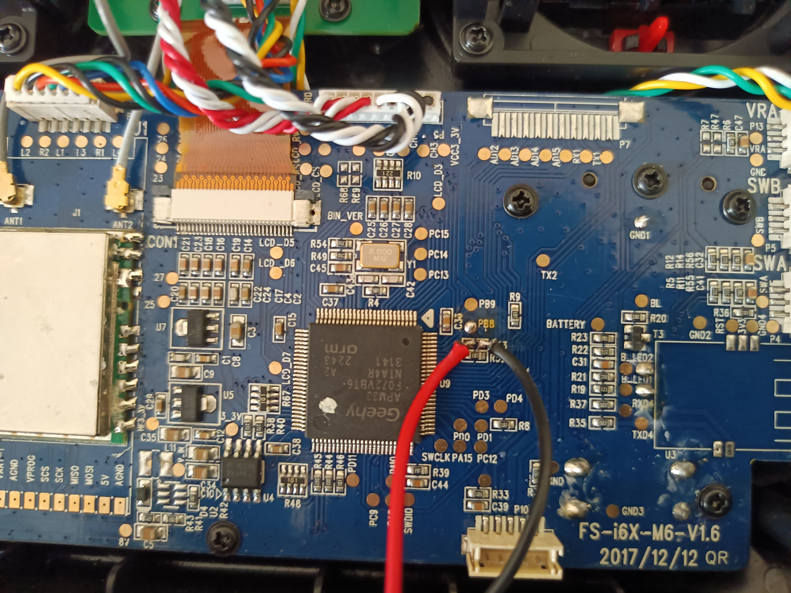
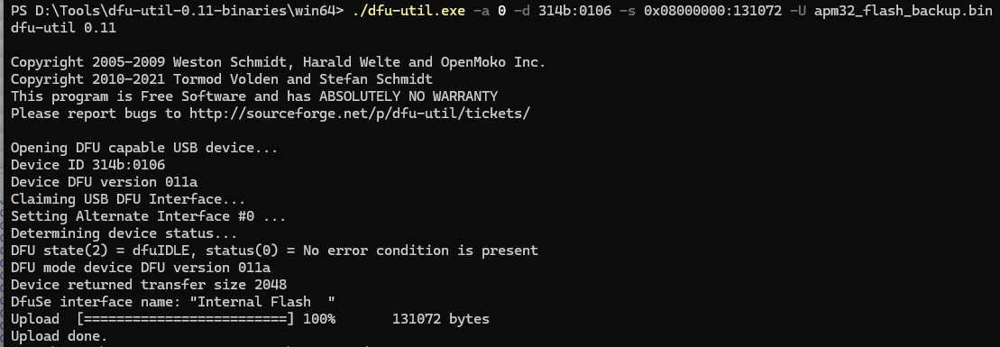
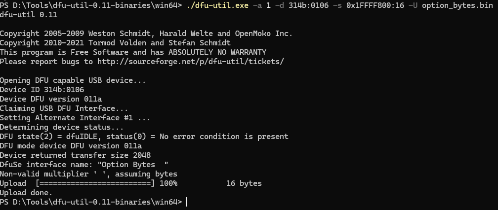
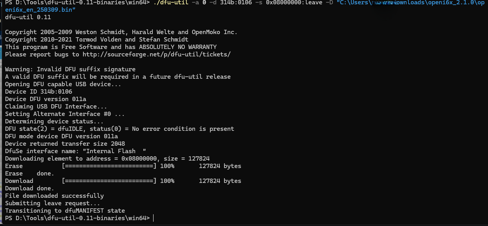

##  Requirements

- USB cable to connect transmitter (generally comes with the Flysky i6X)
- `dfu-util` (install via package manager)

---

##  Flashing OpenI6X Firmware

###  Procedure Overview

1. Identify your transmitter's MCU type.
2. Enter DFU (bootloader) mode by shorting the boot pins.
3. Use `dfu-util` to verify the device.
4. Back up the original firmware.
5. Flash the OpenI6X `.bin` file.

---

###  1. Identify the MCU

Open the transmitter case and visually check the microcontroller marking. If it shows:

…you are using a **non-STM32** chip, and this method applies , if mc is STM32, use the STM programmer https://www.st.com/en/development-tools/stm32cubeprog.html , although this process works fine.

---

###  2. Enter DFU Mode

1. **Turn off** the transmitter.
2. Locate the **boot pins** near the MCU the r53 pad.
3. **Short the boot pins** as shown below:
   
    

4. While keeping the pins shorted, connect the USB cable to your PC.
5. Turn on the transmitter — the screen will stay **off**.
6. [OPTIONL]...Release the boot pin short — you are now in DFU mode.

---

###  3. Check DFU Connection

Run the following in terminal:
- use "https://zadig.akeo.ie" in install required drivers and to troubleshoot check device manager 
- To list devices
```bash
dfu-util -l
```
- Backup Orignal firmware
```bash
./dfu-util.exe -a 0 -d 314b:0106 -s 0x08000000:131072 -U backup_original_firmware.bin

./dfu-util.exe -a 0 -d -d 314b:0106 -s 0x1FFFF800:16 -U backup_eeprom.bin

```



- Flashing firmware
```bash
./dfu-util.exe -a 0 -d 314b:0106 -s 0x08000000:leave -D "path\to_ur\openi6x.bin"
```


- remove boot setup , turn on tx ,to enter in boot menu use trim buttons ckeck 

---

### end of file
=======
# OPENi6x_FLYsky_i6X_non_stm_flashing
Flashing OpenI6X (OpenTX-based firmware) onto the Flysky i6X transmitter using USB DFU mode,DFU flashing instructions, and backup/restore procedures tailored for non-STM-based hardware.
